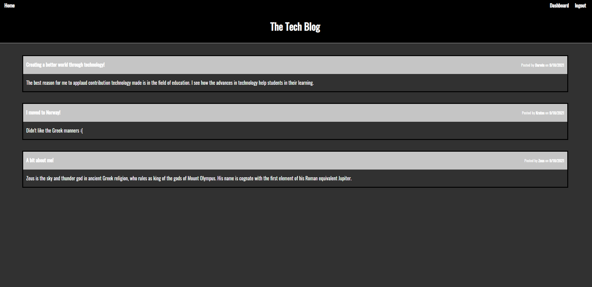
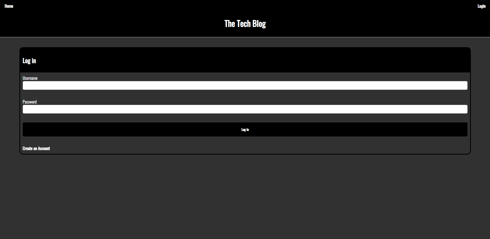
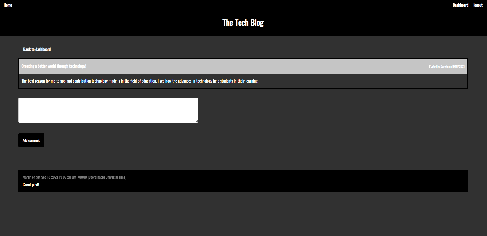

# _The-Tech-Blog_
CMS-style blog site where developers can publish their blog posts and comment on other developers’ posts as well.
> Live demo [_here_](https://the-tech-blog-io.herokuapp.com/). 

## Table of Contents
* [Technologies Used](#technologies-used)
* [Features](#features)
* [Project Status](#project-status)
* [Room for Improvement](#room-for-improvement)

## Technologies Used
- Tech 1 - JavaScript
- Tech 2 - Express
- Tech 3 - Node.js
- Tech 4 - Heroku
- Tech 5 - Sequelize
- Tech 6 - HTML
- Tech 7 - CSS
- Tech 8 - JawsDB
- Tech 9 - bcrypt npm
- Tech 10 - express-session npm
- Tech 11 - connect-session-sequelize npm

## Features
Ready Features:
1. **Allows to view other posts**

2. **Allows to create an account**

3. **Allows the user to login with the username and password before created**

4. **Allows the user to view and comment on other users posts**
  

## Project Status
Project is: _in progress_

## Room for Improvement
Room for improvement:
- TBD

To do:
- Improve design
- Add img uploads
- Increment post functions
